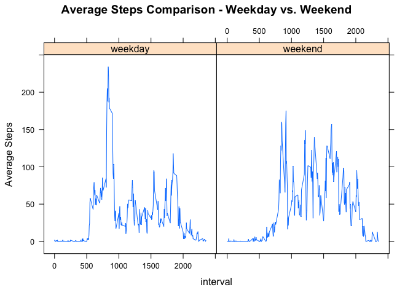

# Reproducible Research for Individual FitBit Study
Jason R. Battles  
`r format(Sys.time(), '%d %B, %Y')`  


The dataset is stored in a comma-separated-value (CSV) file and there are a total of 17,568 observations in this dataset.  
## Loading and preprocessing the data

```r
setwd("~/GitHub/FitBit-Analysis")
IndActivity <- read.csv("activity.csv", stringsAsFactors = FALSE, header = TRUE)
str(IndActivity)
```

```
## 'data.frame':	17568 obs. of  3 variables:
##  $ steps   : int  NA NA NA NA NA NA NA NA NA NA ...
##  $ date    : chr  "2012-10-01" "2012-10-01" "2012-10-01" "2012-10-01" ...
##  $ interval: int  0 5 10 15 20 25 30 35 40 45 ...
```

Load the R packages that will be used later.

```r
library(plyr)
library(lattice)
```

## What is mean total number of steps taken per day?
I summarized the data by date and number of steps using function ddpy from plyr package. Do not remove "NA" values yet. Assign this data set to "tmp" variable. "tmp" gives you the total number of steps by date.

There are 570, 608 steps in this data set

```r
#Summarize dataframe by date, total steps
tmp <- ddply(IndActivity,.(date), summarize, totSteps=sum(steps, na.rm=TRUE))
# Sum of total steps, 570,608 steps.
sum(tmp$totSteps) 
```

```
## [1] 570608
```

I created a histogram of the total number of steps taken each day.  This is the frequency of the number of similar step observations.

```r
hist(tmp$totSteps, breaks = 20, col = "blue", xlab = "Total Steps", main = "Total Steps Taken Each Day")
```

<!-- -->

If I remove the missing values (NA), the Average steps per day are 9354.23 and the median steps per day is 10,395.

```r
# Mean of steps = 9354.23 steps
mean(tmp$totSteps, na.rm=TRUE) 
```

```
## [1] 9354.23
```

```r
# Median of steps = 10,395 steps
median(tmp$totSteps, na.rm=TRUE) 
```

```
## [1] 10395
```


## What is the average daily activity pattern?
I used the plyr package and ddply function, to calculate the average steps per time interval and plot and then assigned this to a tmp2 new data frame tmp2.  The mean  of all 5 minute average step observations is 37.3826.  I will use this number later when I impute values.


```r
#Summarize date set by date, average steps/interval
tmp2<-ddply(IndActivity,.(interval),summarise, AvgSteps=mean(steps, na.rm=TRUE)) 
# Average number of steps to use in imputing NA values
mean(tmp2$AvgSteps) 
```

```
## [1] 37.3826
```

```r
# Plot average steps per interval using a line as the type. 
plot(tmp2, type = "l", col = "blue", main = "Time Series, Avg Steps per Interval", ylab = "Avg Steps", xlab = "5 Min Intervals")
```

<!-- -->

Which interval had the most steps? Time Interval #835 with 206.17 steps observed

```r
#Time Interval #835 had the most steps of all 5 minute intervals with 206.17 steps.
tmp2[which.max(tmp2$AvgSteps),]
```

```
##     interval AvgSteps
## 104      835 206.1698
```

## Imputing missing values
I needed to impute some missing values in order to continue with a more robust analysis. I was also curious to discover if imputing values would materially affect the results of this study.  I took the average of the steps per interval and substituted the average for all NA values. Number of NA values is 2304.


```r
# There are 2304 "NA" or mising values.
sum(is.na(IndActivity))
```

```
## [1] 2304
```

I now grouped the data by date and total steps by calculating the average of the 5 minute interval averages and then using that number to impute the value for NA. 

```r
#Replace NA values with average of average of 5 min values. Merge original data set with tmp2, which shows average.
newIndActivity <- merge(IndActivity, tmp2, by = "interval", sort = TRUE)
index <- is.na(newIndActivity$steps)  #Returns logical vector, true = missing value
#Remove rows of missing values and impute by replacing with #AverageSteps where there was NA, missing value
newIndActivity$steps[index] <- newIndActivity$AvgSteps[index]
#Group on date and total steps
tmp3 <- ddply(newIndActivity, .(date), summarize, TotalSteps = (sum(steps, na.rm = TRUE)))
```

Here is a histogram of average steps per day with using imputed average for missing values.

```r
hist(tmp3$TotalSteps, breaks = 20, col = "blue", xlab = "Total Steps", main = "Total Steps Taken Each Day, Impute NA")
```

<!-- -->

I now calculate the mean and median steps with imputed average numbers replacing missing values. The mean and median are now both 10,766.19 steps. The average and median values using imputed numbers differ from the average and median values which included missing values.  


```r
# Mean of steps with imputed values in place of NA values = 10766.19 steps
mean(tmp3$TotalSteps)
```

```
## [1] 10766.19
```

```r
# Median of steps with imputed values in place of NA values = 10766.19 steps
median(tmp3$TotalSteps)
```

```
## [1] 10766.19
```


## Are there differences in activity patterns between weekdays and weekends?
My analysis revealed that average step counts were generally higher during the weekends but the maximum values were acheived during the weekdays.


```r
# Convert dates into weekdays and weekends
tmp4 <- transform(IndActivity, date = strptime(date, format="%Y-%m-%d"))
#Use weekdays() function to classify day. I commented this line because it was cumbersome to read in GitHub.  
#weekdays(tmp4$date) %in% c("Saturday", "Sunday") 
# Set logical if day is weekday or weekend. I commented this line because it was cumbersome to read in GitHub.  
#factor(weekdays(tmp4$date) %in% c("Saturday", "Sunday"), level=c(TRUE, FALSE), labels=c("weekend", "weekday"))
# Assign factor variable to day. I
day1<-factor(weekdays(tmp4$date) %in% c("Saturday", "Sunday"), level=c(TRUE, FALSE), labels=c("weekend", "weekday"))
#Create new column, weekend, weekend using mutate from plyr
tmp4<-mutate(tmp4, day=day1)
#Plot weekend and weekday averages; change day from POSIXlt format to character format because #ddply does not work on posixlt; it only works on charactoer & number vector.
tmp4<-transform(tmp4, day1=as.character((day1)))  
tmp5<-ddply(tmp4,.(interval,day1), summarize, averagesteps=mean(steps, na.rm = TRUE))
#Plot weekday and weekend average steps per interval using line graph.
#png(filename = "AverageSteps.png")
xyplot(averagesteps~interval|day1, data = tmp5, 
       ylab="Average Steps", 
       type = "l",
       main="Average Steps Comparison - Weekday vs. Weekend")
```

<!-- -->

```r
#dev.off()
```

